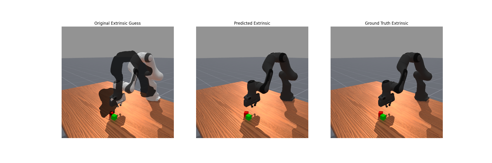
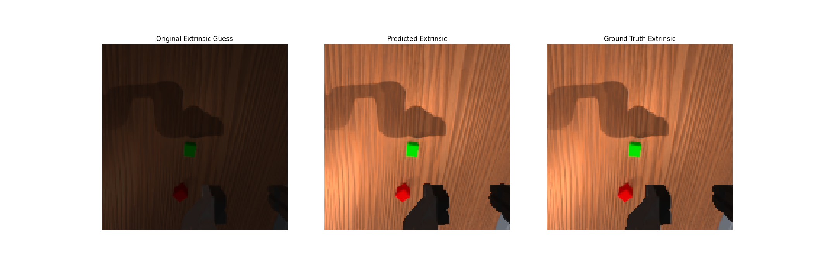

# Simple EasyHec: Accurate and Automatic Camera Calibration

This repo provides (mostly) pip installable code to easily calibrate a camera (mounted and not mounted) and get its extrinsics with respect to some object (like a robot). It is a cleaned up and simplified version of the original [EasyHeC project](https://github.com/ootts/EasyHeC). It works by taking a dataset of segmentation masks of the object and the object poses, and based on the camera intrinsics and an initial guess of the extrinsics, optimizes that guess into an accurate estimate of the true extrinsics. The optimization process leverages [Nvdiffrast](https://github.com/NVlabs/nvdiffrast) for differentiable rendering to run this optimization process.

Image below shows three different segmentation overlays on top of an RGB image in simulation generated by rendering segmentation from various camera poses of a 3rd-view camera. It compares the initial bad extrinsic guess, the optimized estimate, and the ground truth.



Another example below shows it working for a mounted camera. Notice that the initial extrinsic guess is so bad that the segmentation covers the whole image.



## Installation

Install from pip
```bash
pip install easyhec
pip install "nvdiffrast @ git+https://github.com/NVlabs/nvdiffrast.git@729261dc64c4241ea36efda84fbf532cc8b425b8"
```

Install from git (We highly recommend you create a conda/mamba environment to manage packages)

```bash
git clone https://github.com/StoneT2000/simple-easyhec
conda create -n easyhec "python==3.11"
pip install -e .
pip install "nvdiffrast @ git+https://github.com/NVlabs/nvdiffrast.git@729261dc64c4241ea36efda84fbf532cc8b425b8"
```

The code relies on Nvdiffrast which can sometimes be tricky to setup as it can have some dependencies that need to be installed outside of pip. If you have issues installing Nvdiffrast (which provides dockerized options) see their [documentation](https://nvlabs.github.io/nvdiffrast/) or use our google colab script.

For those who don't want to manually segment their robot images you can use [SAM2](https://github.com/facebookresearch/sam2). Follow the installation instructions in that repo to set it up locally. Otherwise this repo provides a simple point annotation interface to annotate provided images with SAM2 to generate segmentation maps.

## Usage

### Simulation

To test in simulation we provide an example through maniskill. The example generates 5 training synthetic images of the Franka/Panda robot with segmentation masks of the robot in random joint positions sampled around the initial joint position, and an initial extrinsic camera guess noisly sampled around the ground truth. By default 10 test images of the robot in different configurations are tested on and saved locally to the `results/` folder. This simulation also has raytracing for nicer renders which is disabled by default, turn it on by adding --shader rt

```bash
pip install easyhec[sim-maniskill]
# Franka arm, camera used here is a offhand 512x512 camera
python -m easyhec.examples.sim.maniskill -e StackCube-v1 --samples 5
```

You can also try out other robots and cameras that ManiSkill provides in other environments like the base camera for SO100


```bash
# SO100 arm, base_camera here is a 128x128 camera 
python -m easyhec.examples.sim.maniskill -e SO100GraspCube-v1 --samples 5 \
    --camera-name base_camera \
    --initial-extrinsic-guess-rot-error 15 --initial-extrinsic-guess-pos-error 0.1
```

Wrist cameras are also possible but are harder to get working. The amount of initial extrinsic error must also be lower since the robot already takes up a large part of the image. If the robot is far away more error is possible to solve from. This is why a specific seed is specified for the script below (the seed determines the direction of error we generate for testing, in some directions its impossible because of occlusion).

```bash
python -m easyhec.examples.sim.maniskill -e StackCube-v1 --samples 5 --seed 2 \
    --camera-name hand_camera \
    --initial-extrinsic-guess-rot-error 5 --initial-extrinsic-guess-pos-error 0.01
```

Instead of using the ground truth segmentation masks of the robot you can also use SAM2 generated masks based on your own point based annotations to reflect what you might do with real world images without access to ground truth data. The script below turns that option on and opens a GUI on your display to let you annotate each generated sample.

```bash
python -m easyhec.examples.sim.maniskill -e StackCube-v1 --samples 5 \
  --model-cfg ../sam2/configs/sam2.1/sam2.1_hiera_l.yaml --checkpoint ../sam2/checkpoints/sam2.1_hiera_large.pt \
  --no-use-ground-truth-segmentation
```

### Real

lerobot example is WIP.

## Customization

This repository is fairly minimal. The core optimization code is in `easyhec/optim` which uses a few 3D geometry related utilities in `easyhec/utils`. Feel free to copy those and modify as needed.

## Tuning Tips

- It is recommended to get a diverse range of sample images that show the robot in different orientations. This is particularly more important for wrist cameras, which often only see the robot gripper.
- The initial guess of the camera extrinsics does not have be good, but if the robot is up very close it may need to be more accurate. This can be the case for wrist cameras.
- To ensure best results make sure you have fairly accurate visual meshes for the robot the camera is attached on / is pointing at. It is okay if the colors do not match, just the shapes need to match.
- While it is best to have accurate visual meshes, this optimization can still work even if you don't include some parts from the real world. It may be useful to edit out poor segmentations.
- It is okay if the loss is in the 1000s and does not go down. Loss values do not really reflect the accuracy of the extrinsic estimate since it can depend on camera resolution and how far away the robot is.

## Citation

If you find this code useful for your research, please use the following BibTeX entries

```
@article{chen2023easyhec,
  title={EasyHec: Accurate and Automatic Hand-eye Calibration via Differentiable Rendering and Space Exploration},
  author={Chen, Linghao and Qin, Yuzhe and Zhou, Xiaowei and Su, Hao},
  journal={IEEE Robotics and Automation Letters (RA-L)}, 
  year={2023}
}
@article{Laine2020diffrast,
  title   = {Modular Primitives for High-Performance Differentiable Rendering},
  author  = {Samuli Laine and Janne Hellsten and Tero Karras and Yeongho Seol and Jaakko Lehtinen and Timo Aila},
  journal = {ACM Transactions on Graphics},
  year    = {2020},
  volume  = {39},
  number  = {6}
}
```